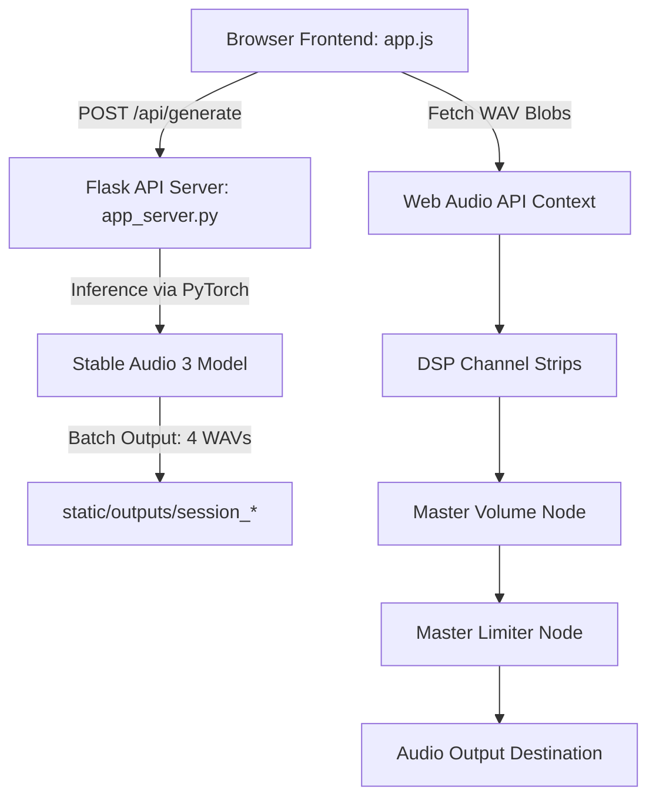

# System Architecture

This article details the system architecture of LoopMaster SA3, outlining frontend-backend boundaries, signal paths, and state design.

## Technical Overview

LoopMaster SA3 operates as a split client-server web application. The frontend handles real-time Web Audio rendering, interactive user controls, and high-performance playback management. The backend manages Python-based model loading, batch inference, audio manipulation, and file formats transcoding.



## System Boundaries

- **Browser Client**:
  - Direct interaction with Web Audio API.
  - Controls playback timing, LFO modulation, and panning.
  - Renders UI controls (knobs, sliders, grid layers) and dynamic waveform visualizers.
  - Manages client-side project file preservation (`.lproj` JSON format).
- **Inference Server**:
  - Exposes API routes via a pure Flask server, eliminating Gradio dependencies for maximum performance and focused web interfacing.
  - Coordinates GPU/CPU execution using PyTorch.
  - Localizes model weights (`stable-audio-3-medium` and `stable-audio-3-small-music`) inside `stable-audio-3/models/`.
  - Appends ACID headers containing tempo (BPM) and beat markers to exported loops.
  - Invokes `ffmpeg` to transcode files dynamically to MP3 and OGG formats.

## Desktop Application

LoopMaster SA3 operates primarily through a native Electron shell for Windows. For details on the launcher, process management, and boot optimizations, see `[[concepts/desktop_app|Desktop Application]]` ([Desktop Application](desktop_app.md)).

## Audio Signal Chain

The audio path for each generated track channel strip is configured in series and in parallel:

```
Track Source Buffer
  → HP Filter (BiquadFilterNode)
  → LP Filter (BiquadFilterNode)
  → Drive Shaper (WaveShaperNode)
  → Luftikus EQ (6× Peaking BiquadFilterNode Chain)
  → Tuna Chorus (tuna.js Chorus)
  → Tuna Phaser (tuna.js Phaser)
  → Tuna Bitcrusher (tuna.js Bitcrusher)
  → Wow Delay Send & Return
  → Spring Reverb Send & Return
  → Stereo Panner Node
  → Channel Gain Node
  → Channel Analyser Node (RMS & Peak meters)
  → Master Gain Node
  → Master Dynamics Compressor (Limiter)
  → Makeup Gain Node (Master ceiling)
  → Master Analyser Node
  → Audio Destination
```

For detailed configurations of individual effects, see `[[concepts/dsp_effects|DSP & FX Processing]]` ([DSP & FX Processing](dsp_effects.md)).

## Frontend State Design

Key application states managed in `app.js`:
- `tracks`: A dynamic array containing track row specifications, active AudioBufferSourceNodes, visual properties, and independent FX channel settings.
- `audioCtx`: The global shared `AudioContext` driving real-time audio playback.
- `copiedTrackSettings` & `copiedFxSettings`: In-memory serialization objects acting as clipboards for copying and pasting parameters.
- `currentKeyOrChord`: A state track of the active chord progression or key signature used to constrain prompt modifiers.
- `arrangerLengthLoops`: The length of the arranger grid timeline measured in loops.

## Playback Synchronization & Timeline

- **Context Time**: Playback loops are scheduled using `audioCtx.currentTime`.
- **BPM Boundaries**: Switches between variants are quantized to the loop boundary when **Split Mode** is active.
- **Dynamic Looping**: Loop cycles are computed based on the maximum duration among all active track variants rather than a fixed interval.

## Related Documents
- `[[concepts/generation_pipeline|Generation Pipeline]]` ([Generation Pipeline](generation_pipeline.md))
- `[[concepts/dsp_effects|DSP & FX Processing]]` ([DSP & FX Processing](dsp_effects.md))
- `[[references/api_reference|API Reference]]` ([API Reference](../references/api_reference.md))
