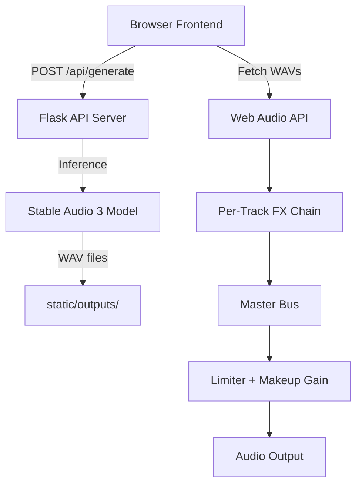

# Architecture & Technical Reference

Technical internals for developers working on LoopMaster SA3.

For user-facing documentation, see the [User Guide](User-Guide.md).

---

## System Overview



**Backend**: Python Flask server (`app_server.py`) handling generation requests, model inference via PyTorch/CUDA, and WAV post-processing.

**Frontend**: Single-page app (`index.html` + `app.js` + `app.css`) using Web Audio API for real-time playback, mixing, and DSP.

---

## API Endpoints

### POST /api/generate
Creates a new track with four variants.

**Request body:**
```json
{
  "prompt": "dreamy solo piano in C minor",
  "bpm": 120,
  "seed": -1,
  "cfg_scale": 1.0,
  "steps": 8,
  "init_audio_path": null,
  "init_noise_level": 0.6,
  "remix_mode": "variation",
  "invert_timing": false,
  "inpaint_start": null,
  "inpaint_end": null
}
```

**Response:** Job ID for polling.

### GET /api/status/{job_id}
Poll for generation progress. Returns variant file paths when complete.

### POST /api/regenerate
Regenerates unlocked variants for an existing track.

---

## Generation Pipeline

1. **Prompt Enhancement** — Backend prepends `solo`, appends `seamless loop`, adds BPM/duration metadata
2. **Headroom Buffer** — Generates `duration + 2.0s` to prevent tail decay, then hard-trims to exact loop length
3. **Batch Inference** — Runs SA3 model.generate() for 4 variants per request
4. **ACIDization** — Injects `acid`, `cue`, and `LIST` chunks into WAV headers for DAW compatibility (tempo, key, 16-beat markers)

### Remix Modes (Backend)
| Mode | Implementation |
|------|---------------|
| **Variation** | `init_audio` + `init_noise_level` passed to model.generate() |
| **Response** | Inpainting with mask on second 50% of loop |
| **Inpaint** | `inpaint_mask` tensor (0=keep, 1=regenerate) over user-defined time range |
| **Continuation** | Inpaint mask from split point to end |
| **Invert Timing** | `torch.flip(waveform, dims=[-1])` on seed before generation |

---

## Audio Signal Chain

Per-track processing order:

```
Source Buffer
  → Filtr (BiquadFilterNode)
  → Luftikus EQ (6× BiquadFilterNode)
  → Scream (WaveShaperNode + BiquadFilterNode)
  → Tuna Chorus (tuna.js Chorus node)
  → Tuna Phaser (tuna.js Phaser node)
  → Tuna Bitcrusher (tuna.js Bitcrusher node)
  → Ælapse Delay (DelayNode + feedback loop + LFO)
  → Ælapse Reverb (ConvolverNode)
  → StereoPannerNode
  → GainNode (volume)
  → AnalyserNode (metering)
  → Master GainNode
  → Master Limiter (DynamicsCompressorNode)
  → Makeup GainNode
  → Master AnalyserNode
  → Destination
```

### Master Limiter Settings
| Parameter | Value | Purpose |
|-----------|-------|---------|
| Threshold | Dynamic (0 to -30 dB) | Coordinated with master volume fader |
| Knee | 0 | Hard knee |
| Ratio | 20:1 | Limiter behavior |
| Attack | 3 ms | Fast transient catch |
| Release | 100 ms | Natural decay |
| Makeup Gain | Dynamic (+0 to +30 dB) | Auto-compensated post-limiting gain |

### Metering
Three-layer horizontal canvas meters per track and master:
- **RMS** — Perceived loudness with leaky integration (α=0.85)
- **Peak** — Instantaneous peak, decays at 12 dB/s
- **Peak Hold** — Highest peak held for 1.5s, then decays at 15 dB/s
- **Color scale** — Green (-60 to -18dB), Yellow (-18 to -6dB), Red (-6 to 0dB)

---

## DSP Effect Implementations

### Filtr
- `BiquadFilterNode` with switchable type (lowpass, bandpass, highpass, notch)
- Cutoff: 20Hz–20kHz, Q: 0.1–25
- Dry/wet via parallel GainNodes

### Luftikus EQ
- 6× `BiquadFilterNode` (peaking) at fixed frequencies: 10, 40, 160, 640, 2500, 12000 Hz
- Last band is high-shelf ("Air")
- ±12dB range, 0.5dB steps

### Scream
- `WaveShaperNode` with sigmoid distortion curve
- Pre-filter `BiquadFilterNode` (lowpass, 200Hz–16kHz) for harshness control
- Q/drive coupled to single "Scream" parameter

### Tuna.js Effects (Chorus, Phaser, Bitcrusher)
- **Chorus**: Stereo chorus with adjustable Rate (free 0.01-8Hz or tempo-synced), Depth (0-1), and Feedback (0-0.95).
- **Phaser**: Multi-stage phaser with adjustable Rate (free or tempo-synced), Depth (0-1), and Feedback (0-1).
- **Bitcrusher**: Lo-fi decimation effect with adjustable Bits resolution (1-16) and normalized frequency sampling (0.001-1.0).

### Ælapse (Unified Controls)
- **Delay Mix (DMx)**: Single macro control that caps delay mix at 75% wet. As DMx is increased, feedback (`DFb`) is automatically scaled up proportionally from 0% to 95%. LFO (2Hz) modulates delay time by ±2ms for tape wow/flutter.
- **Reverb Mix (RMx)**: Single macro control that caps reverb mix at 80% wet. As RMx is increased, reverb size (`RSz`) automatically scales up from 0.5s to 5.0s, rebuilding the convolver impulse response on the fly.
- **Tempo-Synced delay times** via beat division lookup.

---

## Global Modulators & Modulation Matrix

LoopMaster SA3 features a global modulation engine containing four independent Low Frequency Oscillators (LFOs) routed via an 8-slot Modulation Routing Matrix embedded directly in the Global Modulators panel.

### LFO Modulators (LFO 1–4)
- **Controls**: Shape (Sine, Triangle, Saw, Square, S&H/Random), Sync to BPM (on/off), Rate (Synced to beat divisions from 4 bars down to 1/16 note, or free-running from 0.1Hz to 20Hz), and On/Off bypass.
- **Real-Time Integration**: The `requestAnimationFrame` loop calculates phase progress per LFO based on `AudioContext.currentTime` and BPM parameters, dynamically updating target parameters.
- **Offline bounce replication**: The `OfflineAudioContext` mixdown engine duplicates LFO shape calculations and applies parameter offsets at 50ms intervals during offline rendering.

### Modulation Matrix
- **Slots**: 8 independent routing paths.
- **Routing parameters**:
  - **Source**: LFO 1, LFO 2, LFO 3, or LFO 4.
  - **Destination**: Any active track channel (T1, T2, etc.) or Master bus.
  - **Target Parameter**: Volume (`level`), Pan (`pan`), Filter (`filter`), Space (`space`), Drive (`drive`), Chorus Rate (`chorusRate`), Chorus Depth (`chorusDepth`), Chorus Feedback (`chorusFeedback`), Phaser Rate (`phaserRate`), Phaser Depth (`phaserDepth`), Phaser Feedback (`phaserFeedback`), Crusher Bits (`crusherBits`), and Crusher Norm Frequency (`crusherNormfreq`).
  - **Depth**: ±100% bipolar modulation depth.
- **Bypassing**: Global "Byp" toggle checkbox in the Matrix container bypasses all matrix slots simultaneously.
- **Modulation Indicators**: Sliders on mapped parameters display real-time animated indicator dots mapping active modulation values.

---

## Frontend State

Key state managed in `app.js`:

- `tracks[]` — Array of track objects (audio buffers, source nodes, FX graph, mixer state)
- `audioCtx` — Shared `AudioContext` for all playback
- `initAudioState` — Current remix seed configuration
- `undoStack` — Deleted track snapshots for undo

### Playback Synchronization
All tracks share a single `AudioContext.currentTime` reference. Loop boundaries are calculated from BPM. Variant switches can be instant or queued to the next loop boundary (Split mode).

### Offline Rendering
`OfflineAudioContext` replicates the full FX graph, renders to buffer, encodes as 16-bit PCM WAV with 5s fade-out tail.

---

## File Structure

```
loopmaster/
└── loopmaster-app/
    ├── app_server.py          # Flask routes, SA3 inference, WAV post-processing
    ├── generate_variants.py   # CLI prompt generator helper
    └── static/
        ├── index.html         # Layout and controls
        ├── app.js             # Audio engine, FX, UI logic (~336KB)
        ├── app.css            # Dark theme, responsive grid (~46KB)
        ├── tuna.js            # Tuna.js DSP library
        └── outputs/           # Generated WAV files (gitignored)
```

---

## Credits & References

| Component | Source |
|-----------|--------|
| SA3 Model | [Stability AI](https://stability.ai/) |
| Luftikus EQ | [lkjbdsp/Luftikus](https://github.com/lkjbdsp/lkjb-plugins/tree/master/Luftikus) |
| Ælapse | [smiarx/aelapse](https://github.com/smiarx/aelapse) |
| Scream | [Cure-Audio/Scream](https://github.com/Cure-Audio/Scream) |
| Filtr | [tiagolr/filtr](https://github.com/tiagolr/filtr) |
| Tuna.js | [Dinahmoe/tuna](https://github.com/Dinahmoe/tuna) |

---

## Release Notes & Updates (Session 2026-05-28)

Several key improvements were successfully implemented:

### 1. Bfloat16 (BF16) Precision Mode Support
- **Feature**: Added a memory-optimized **BF16 precision mode** option for the Stable Audio 3 Medium model (`dummy9996/stable-audio-3-bf16-comfyui`), dramatically reducing VRAM usage.
- **Precision Toggle**: Kept the pure **FP32 mode** option for high-end systems (launching with `--no-half` via option `[1]`), while offering BF16 via option `[4]` in the launcher (`run_server.bat`).

### 2. Tuna.js Effects & BPM Sync Integration
- **Feature**: Integrated **Tuna.js** into the per-track channel DSP strip, adding premium Chorus, Phaser, and Bitcrusher effects.
- **Sync Logic**: Connected LFO modulation rates to tempo-sync beat divisions, adjusting rates automatically on global BPM shifts.

### 3. Waveform End Gap Fix
- **Issue**: Waveform canvases showed a silent flat line at the rightmost 20% due to the 2-second loop tail headroom padding in the WAV file.
- **Fix**: Truncated drawing samples to only match the active loop duration, aligning visual peaks with the playhead and playback loop perfectly.

### 4. Valentine & Favorites Bar Removal
- **Refinement**: Removed the Valentine saturation/compression section and the favorites bar to keep the UI clean, lightweight, and focused.

