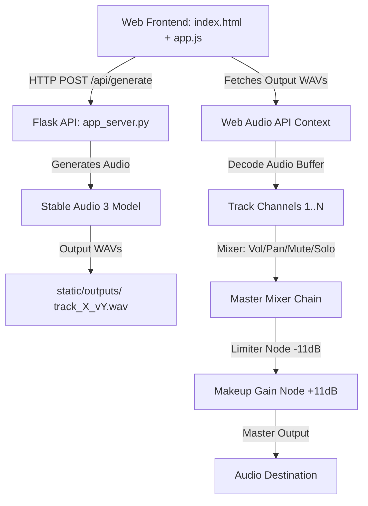

# LoopMaster SA3 Knowledge Wiki

Welcome to the official technical wiki for **LoopMaster SA3**, a high-performance, real-time synchronized multi-track grid generator and mixer built on top of the Stable Audio 3 generative music foundation model.

---

## 1. System Architecture

LoopMaster SA3 consists of a Python-based PyTorch inference server (Flask) and a highly responsive, premium Web Audio API-driven frontend.



### Signal Processing Chain (Web Audio API)
To achieve clean, loud, and balanced multi-track playback, each track has its own independent channel strip with dedicated analog EQ and creative processors, which sums into a master limiter and makeup gain chain:

$$\text{Track Source} \rightarrow \text{Luftikus EQ} \rightarrow \text{Valentine} \rightarrow \text{Ælapse} \rightarrow \text{Track Compressor} \rightarrow \text{Track Panner} \rightarrow \text{Track Gain} \rightarrow \text{Track Analyser} \rightarrow \text{Master Gain} \rightarrow \text{DynamicsCompressorNode (Limiter)} \rightarrow \text{GainNode (Makeup)} \rightarrow \text{Master Analyser} \rightarrow \text{Destination}$$


---

## 2. Master Limiter & Metering Design

### Master Limiter (Option A)
To prevent digital clipping while maximizing loudness, a brickwall limiter is placed directly on the master output before the audio destination:
*   **Threshold**: `-11.0 dB` (brickwall compression ceiling)
*   **Knee**: `0.0` (hard knee)
*   **Ratio**: `20.0` (acting as a limiter)
*   **Attack**: `0.003s` (3ms fast lookahead attack)
*   **Release**: `0.1s` (100ms release)
*   **Makeup Gain**: `+11.0 dB` (calculated as $10^{11/20} \approx 3.548$ linear gain multiplier) to restore headroom and boost overall loudness.

### Per-Track Compressor
Each mixer track has an inline `DynamicsCompressorNode` at the end of the signal chain (before panner/gain):
*   **Threshold**: `-6 dB`
*   **Ratio**: `5:1`
*   **Attack**: `10ms`

### Real-Time Loudness Metering
Each track row and the master channel strip feature real-time horizontal canvas-based level meters showing three components:
1.  **RMS (Root Mean Square)**: Represents perceived loudness, calculated over time window blocks with leaky integration smoothing ($\alpha = 0.85$):
    $$x_{\text{RMS}}[n] = 0.85 \cdot x_{\text{RMS}}[n-1] + 0.15 \cdot x_{\text{current\_RMS}}$$
2.  **Peak**: Instantaneous signal peak, rises instantly and decays at a rate of `12 dB/s` to show fast transients.
3.  **Peak Hold**: Holds the highest peak for `1.5s` before decaying at a rate of `15 dB/s`, marked by a cyan tick indicator.
*   **Color Scale**: Green (`-60dB` to `-18dB`), Yellow (`-18dB` to `-6dB`), Red (`-6dB` to `0dB`).

---

## 3. SA3 Generation Controls

Exposed through the UI alongside BPM:

| Parameter | Default | Range | Description |
|-----------|---------|-------|-------------|
| **Seed** | -1 | -1 to 999999 | Random seed for deterministic generation (-1 = random) |
| **Steps** | 8 | 1 to 100 | Diffusion denoising steps. More = higher quality but slower generation |

> **Note**: CFG (Classifier-Free Guidance) defaults to `1.0` and is not exposed in the UI. It is sent to the backend automatically.

### Generation Headroom
To prevent audio content from dying off before the loop boundary, the server generates `duration + 2.0s` of audio and hard-trims to the exact loop length before saving. This ensures waveforms fill the entire loop.

---

## 4. Init Audio Variation Flow

LoopMaster SA3 allows taking any generated loop variant and using it as the seed (initial audio) to create cohesive variations:

1.  **Selection**: Click the `Remix` button on any variant card to set it as the seed audio.
2.  **Noise Level Control**: Adjust the noise slider (`0.10` to `0.90`). A lower noise level (e.g. `0.20`) stays very close to the original, while a higher noise level (e.g. `0.80`) introduces creative deviations.
3.  **Backend Loading**:
    *   The backend loads the seed WAV file using `torchaudio.load()`.
    *   Waveform tensors are moved to the active model device.
    *   Tensors are fed to `model.generate` via the `init_audio` parameter alongside the specified `init_noise_level`.

---

## 5. Visualizer Tray

A real-time audio visualizer panel sits between the transport bar and the track rows, inspired by [pulse-visualizer](https://github.com/Beacroxx/pulse-visualizer). Three canvases driven by the master output via Web Audio `AnalyserNode`:

| Panel | Description |
|-------|-------------|
| **Spectrum Analyzer** | Log-frequency FFT bars (128 bands, 20Hz–20kHz) with blue→purple→pink→red gradient |
| **Oscilloscope** | Real-time waveform trace with blue glow effect |
| **Peak Meters** | L/R bar meters with green→yellow→red gradient |

---

## 6. Playback Controls

### Seek Toggle
When **Seek** is ON (default), clicking on a waveform card jumps the playhead to that position. When OFF, clicks only select the variant without seeking.

### Card Click Zones
Each variant card has two click zones:
*   **Left half** — Queues the variant switch at the next loop boundary (pulsing amber dashed border). On hover, shows `◀ queue`.
*   **Right half** — Instantly switches to the variant. On hover, shows `instant ▶`.

### Number Input Interaction
All number inputs (BPM, Seed, Steps) support two interaction modes:
*   **Click** — Focuses the input for keyboard typing.
*   **Drag ↕** — After 3px of vertical mouse movement, enters drag mode for rapid value adjustment.

### Reverse
Reverses a clip's audio data in-place. Only restarts the specific track source — does not interrupt other tracks.

---

## 7. Random Prompt Generators

Five preset prompt buttons for rapid creation. Generators include mood, production style, and drum element modifiers per SA3 docs:

| Button | Pool | Key-aware |
|--------|------|-----------|
| 🎲 Random | 53 instruments × 35 styles × 24 moods × 12 production tags | Sets new key |
| 🔑 In Key | Same pool, preserves current key/chord | Uses current key |
| 🥁 Drums | 32 genres × 24 descriptors × 10 drum elements | BPM only |
| 🎸 Bass | 48 bass styles × 28 descriptors | Uses current key |
| 🎹 Lead | 48 lead styles × 32 descriptors | Uses current key |

### SA3 Prompt Format
SA3 responds best to structured natural language prompts:
```
[Mood] + [Format] + [Instrument] + [Style/Genre] + [Key] + [Production]
```
*   **Mood**: euphoric, dark, dreamy, aggressive, nostalgic, etc.
*   **Format**: solo, duo, band, orchestra
*   **Instruments**: Be specific (alto saxophone > saxophone)
*   **Production**: lo-fi, vintage analog, studio quality, tape saturated
*   **Key**: Include key/scale for harmonic coherence across layers


---

## 8. Export & Render

| Action | Description |
|--------|-------------|
| **Render Mix** | Offline renders all tracks through their full FX chains into a single WAV file. Configurable loop count via "Loops to Render" input. |
| **Export Loops** | Collects all currently selected (non-muted) variant WAVs, zips them client-side with JSZip, and downloads as `loopmastersa_loops_XXXbpm.zip`. |
| **Undo** | Restores the last deleted track (DOM + audio state). Uses a stack-based system. |

---

## 9. Channel Strip DSP Effects

Each track row features an expandable effects drawer containing three hardware-modeled creative processors. FX parameter labels and value readouts are center-aligned for visual consistency.

### 1. Luftikus Analog EQ
A 6-band analog-modeled equalizer featuring standard fixed-frequency bands for musical tone shaping:
*   **Bands**: Peaking filters at `10Hz`, `40Hz`, `160Hz`, `640Hz`, and `2.5kHz`, plus a high-shelf boost (`Air Band`) at `12kHz`.
*   **Range**: Each band can be boosted or attenuated by up to `12.0 dB` (adjustable in `0.5 dB` steps).

### 2. Valentine Compressor & Saturator
Inspired by Justice-style hyper-compressed pumping textures, this dual-stage processor provides parallel saturation and dynamic compression:
*   **Saturator (Drive)**: A `WaveShaperNode` loaded with a sigmoid mathematical distortion curve. The input gain drives the saturator to add rich odd-order harmonics and soft-clipping warmth.
*   **Compressor**: A `DynamicsCompressorNode` (variable threshold from `-40dB` to `0dB`, and ratio up to `20:1`) to squeeze transients and introduce heavy pumping breath.
*   **Mix**: Controls the wet/dry gain blend for parallel compression and grit scaling (from `0%` to `100%`).

### 3. Ælapse Tape Delay & Spring Reverb
A time and space processor combining delay time modulation and programmatic convolution:
*   **Tape Delay**: A `DelayNode` (up to `2.0s` delay time) with a feedback loop (`GainNode` up to `95%` feedback). To simulate tape wobble instability, a `2Hz` low-frequency oscillator (LFO) modulates the delay line by `2ms` to create dynamic chorus/flange wow and flutter.
*   **Spring Reverb**: A `ConvolverNode` loaded with a programmatically generated stereo impulse response. The impulse simulates spring dispersion and metallic reflections using decayed white noise combined with chirp waveforms.
*   **Mix Nodes**: Independent dry/wet gain controls for the delay and reverb paths.

---

## 10. Technology & Model Credits

LoopMaster SA3 relies on a combination of generative AI, customized Web Audio DSP modeling, and model-context infrastructure:

*   **Stable Audio 3 (SA3)**: Stability AI's generative stereo music foundation model, which outputs 44.1kHz loopable variations.
*   **smiarx/aelapse (Ælapse)**: The tape delay (wow/flutter modulation) and synthetic convolution model is adapted from the [Ælapse](https://github.com/smiarx/aelapse) processor.
*   **tote-bag-labs/valentine (Valentine)**: The parallel saturation and justice-style pumping compressor is modeled after the [Valentine](https://github.com/tote-bag-labs/valentine) design.
*   **lkjbdsp/Luftikus (Luftikus)**: The 6-band analog-modeled hardware equalization curves are built on top of the [Luftikus EQ](https://github.com/lkjbdsp/lkjb-plugins/tree/master/Luftikus) layout.
*   **AnClark/Comprez**: Per-track compressor design inspired by the [Comprez](https://github.com/AnClark/Comprez) plugin.
*   **pulse-visualizer**: Visualizer tray design inspired by [pulse-visualizer](https://github.com/Audio-Solutions/pulse-visualizer) (spectrum analyzer, oscilloscope, peak meters).
