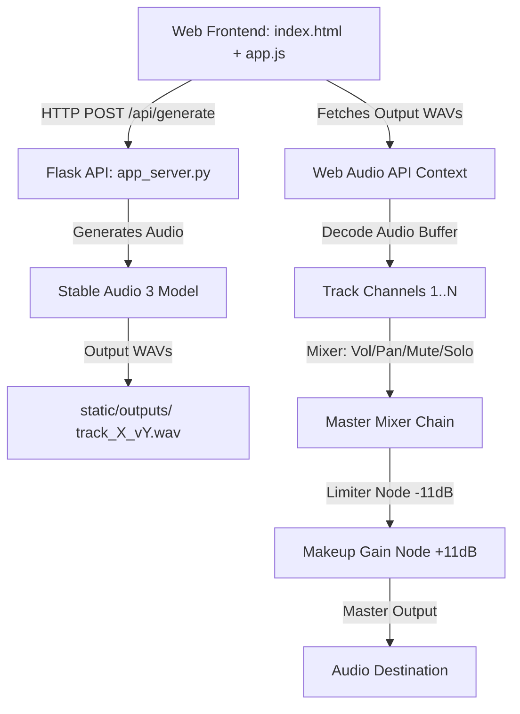

# LoopMasterSA Knowledge Wiki

Welcome to the official technical wiki for **LoopMasterSA**, a high-performance, real-time synchronized multi-track grid generator and mixer built on top of the Stable Audio 3 generative music foundation model.

---

## 1. System Architecture

LoopMasterSA consists of a Python-based PyTorch inference server (Flask) and a highly responsive, premium Web Audio API-driven frontend.

### Signal Processing Chain (Web Audio API)
To achieve clean, loud, and balanced multi-track playback, each track has its own independent channel strip, which sums into a master limiter and makeup gain chain:

$$\text{Track Source} \rightarrow \text{Track Panner} \rightarrow \text{Track Gain} \rightarrow \text{Track Analyser} \rightarrow \text{Master Gain} \rightarrow \text{DynamicsCompressorNode (Limiter)} \rightarrow \text{GainNode (Makeup)} \rightarrow \text{Master Analyser} \rightarrow \text{Destination}$$

---

## 2. Master Limiter & Metering Design

### Master Limiter (Option A)
To prevent digital clipping while maximizing loudness, a brickwall limiter is placed directly on the master output before the audio destination:
*   **Threshold**: `-11.0 dB` (brickwall compression ceiling)
*   **Knee**: `0.0` (hard knee)
*   **Ratio**: `20.0` (acting as a limiter)
*   **Attack**: `0.003s` (3ms fast lookahead attack)
*   **Release**: `0.1s` (100ms release)
*   **Makeup Gain**: `+11.0 dB` (calculated as $10^{11/20} \approx 3.548$ linear gain multiplier) to restore headroom and boost overall loudness.

### Real-Time Loudness Metering
Each track row and the master channel strip feature real-time horizontal canvas-based level meters showing three components:
1.  **RMS (Root Mean Square)**: Represents perceived loudness, calculated over time window blocks with leaky integration smoothing ($\alpha = 0.85$):
    $$x_{\text{RMS}}[n] = 0.85 \cdot x_{\text{RMS}}[n-1] + 0.15 \cdot x_{\text{current\_RMS}}$$
2.  **Peak**: Instantaneous signal peak, rises instantly and decays at a rate of `12 dB/s` to show fast transients.
3.  **Peak Hold**: Holds the highest peak for `1.5s` before decaying at a rate of `15 dB/s`, marked by a cyan tick indicator.
*   **Color Scale**: Green (`-60dB` to `-18dB`), Yellow (`-18dB` to `-6dB`), Red (`-6dB` to `0dB`).

---

## 3. Init Audio Variation Flow

LoopMasterSA allows taking any generated loop variant and using it as the seed (initial audio) to create cohesive variations:

1.  **Selection**: Click the `✨ Init` button on any variant card to set it as the seed audio.
2.  **Noise Level Control**: Adjust the noise slider (`0.10` to `0.90`). A lower noise level (e.g. `0.20`) stays very close to the original, while a higher noise level (e.g. `0.80`) introduces creative deviations.
3.  **Backend Loading**:
    *   The backend loads the seed WAV file using `torchaudio.load()`.
    *   Waveform tensors are moved to the active model device.
    *   Tensors are fed to `model.generate` via the `init_audio` parameter alongside the specified `init_noise_level`.
